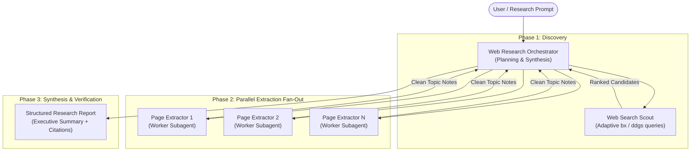

# Deep Research Agents 🕵️‍♂️⚡

> **Autonomous multi-agent deep research framework for systematic web exploration, parallel extraction, and analytical synthesis across complex domains.**

---

## Overview

General LLMs suffer from severe context bloat and hallucination when asked to research broad or technical topics directly. **Deep Research Agents** solves this through a **hierarchical multi-agent architecture** that decouples URL discovery, deep-page extraction, and synthesis.

By running specialized subagents in parallel, the framework gathers evidence across dozens of disparate sources in seconds while preserving pristine context for rigorous analytical synthesis.

---

## System Architecture



---

## Key Capabilities & Why It Works

| Feature | Why It Matters |
|---|---|
| **Zero Context Bloat** | The orchestrator never reads raw HTML or 100-line search dumps. Subagents condense pages into dense factual snippets before returning. |
| **Parallel Extraction Fan-Out** | Ingests 10–30 web pages simultaneously rather than crawling sequentially. |
| **Strict Citation Graph** | Every claim in the final report is anchored to a specific source URL and publisher. |
| **Dual Search Backends** | Native support for **Brave Search (`bx`)** and **DuckDuckGo (`ddgs`)** with zero mandatory paid API keys. |
| **Cross-Platform** | Optimized for GitHub Copilot Agent Mode and Claude Code CLI. |

---

## Prompt Library (`prompts/`)

The repository includes pre-built research playbooks ready to run:

1. **`company-deep-dive.prompt.md`** — 360° corporate audit (business model, architecture, funding, executive pedigree, hiring velocity, moat risks).
2. **`tool-stack-comparison.prompt.md`** — Multi-tool benchmark evaluating latency, developer ergonomics, pricing tiers, and production failure modes.
3. **`product-user-sentiment-teardown.prompt.md`** — Voice-of-customer scraping across G2, Capterra, Reddit, and Trustpilot to uncover churn triggers.
4. **`regulatory-market-scan.prompt.md`** — Scans legal and regulatory mandates (e.g. EU AI Act, CMS healthcare rules) to pinpoint software market opportunities.
5. **`nordic-ai-company-discovery.prompt.md`** — Systematically maps AI-native startups across Nordic hubs matching specific talent or investment criteria.

---

## Real Sample Research Reports (`examples/`)

Inspect full-length, unedited reports produced by the system:

- 🔬 [`research_electromagnetic_fields_emf_and_health_20260720.md`](examples/research_electromagnetic_fields_emf_and_health_20260720.md) — Comprehensive scientific literature review and consensus teardown on EMF exposure and public health.
- 💼 [`research_nordic_capital_fund_activity_and_ai_20260721.md`](examples/research_nordic_capital_fund_activity_and_ai_20260721.md) — Private equity portfolio analysis and AI leadership capability mapping.
- 🎯 [`research_redpine_ai_20260820.md`](examples/research_redpine_ai_20260820.md) — Company intelligence and competitive positioning deep dive.
- 📈 [`research_etsy_traffic_tips_20260801.md`](examples/research_etsy_traffic_tips_20260801.md) — E-commerce marketplace SEO algorithms and organic search velocity mechanics.

---

## Quickstart

### 1. Installation

```bash
# Clone the repository
git clone https://github.com/mfdel/deep-research-agents.git
cd deep-research-agents

# Set up virtual environment with uv (Python 3.12)
uv venv --python 3.12
source .venv/bin/activate
uv pip install -e .
```

### 2. Running in GitHub Copilot or Claude Code

**In GitHub Copilot Agent Mode:**
1. Open any prompt file from `.github/prompts/` (e.g. `company-deep-dive.prompt.md`).
2. Fill in the target company or question.
3. Trigger `@agent Web Research Orchestrator`.

**In Claude Code:**
```bash
claude -p "Research the production failure modes and memory bottlenecks of pgvector vs Qdrant in multi-tenant RAG systems. Save the report in research/"
```

---

## License

MIT License. Built and maintained by [M. Fuat Deligoz](https://github.com/mfdel).
